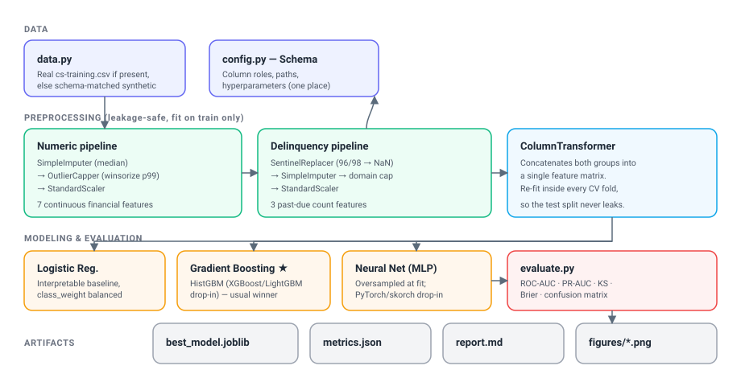

# Defensible Credit Default Prediction Pipeline

A modular, production-oriented machine-learning pipeline that ingests messy
borrower data, cleans it through a **leakage-safe** preprocessing stack, and
benchmarks an interpretable baseline against more complex models under the
metrics a credit-risk audience actually uses.

> **TL;DR for reviewers:** this is not a notebook. It is a small Python package
> with a single-command run, a test suite, and a Docker image. The emphasis is
> on the things that distinguish production ML from a Kaggle script: rigorous,
> reproducible preprocessing with no train/test leakage; honest,
> imbalance-aware evaluation; and clean packaging.

---

## The business problem

Lenders must estimate the probability that a borrower becomes **90+ days
delinquent within two years** and decide whether to extend credit. Two
properties make this harder than a textbook classification task:

1. **The data is messy and adversarial to clean modeling.** Income and
   dependent-count fields are missing for a large share of applicants;
   delinquency columns carry sentinel codes (`96`, `98`) that masquerade as
   real counts; and financial ratios such as revolving utilization and debt
   ratio have extreme right tails (values in the thousands where the sensible
   range is roughly 0–1).
2. **Defaults are rare (~7%).** A model that predicts "no default" for everyone
   scores ~93% accuracy and is completely useless. Ranking and calibration
   metrics — not accuracy — are what matter.

This project tackles both directly, on the schema of the well-known
[Give Me Some Credit](https://www.kaggle.com/c/GiveMeSomeCredit) dataset.

---

## Architecture



The design separates concerns so each layer is independently testable:

| Layer | Module | Responsibility |
|---|---|---|
| Config | `config.py` | Single source of truth for the dataset **schema**, file paths, split and model hyperparameters. Re-point to another dataset by editing one dataclass. |
| Data | `data.py` | Loads the real CSV if present; otherwise generates a schema-matched synthetic sample that reproduces the real data's defects. |
| Cleaning | `transformers.py`, `preprocessing.py` | Custom sklearn transformers (sentinel handling, winsorization) composed into a `ColumnTransformer`. |
| Models | `models.py` | Three benchmarked pipelines, each `preprocessor → estimator`. |
| Evaluation | `evaluate.py` | Credit-risk metric suite (ROC-AUC, PR-AUC, KS, Brier). |
| Reporting | `plots.py`, `report.py`, `train.py` | Figures, Markdown report, JSON metrics, persisted best model. |

### Why the preprocessing is "leakage-safe"

Every cleaning step — median imputation values, the winsorization bounds, the
scaler's mean/variance — is a **fitted parameter learned on the training split
only**, because each transformer lives inside the sklearn `Pipeline`. During
5-fold cross-validation the entire preprocessing stack is re-fit on each fold's
training portion, so no information from the held-out data ever influences how
the training data is cleaned. This is a subtle but critical correctness
property that a "clean the whole dataframe, then split" notebook silently
violates.

---

## Results

The model comparison below was produced by `python -m credit_risk.train` on the
real [Give Me Some Credit](https://www.kaggle.com/c/GiveMeSomeCredit) training
data (150,000 borrowers). The expected and observed finding is that **gradient
boosting wins on this tabular data**, with the logistic-regression baseline a
respectable, fully interpretable second, and the neural network — given a fair,
oversampled, well-regularized setup — trailing third.

| Model | CV ROC-AUC | Test ROC-AUC | PR-AUC | KS | Brier |
|---|---|---|---|---|---|
| Logistic Regression | 0.853 ± 0.004 | 0.859 | 0.384 | 0.559 | 0.146 |
| **Gradient Boosting (best)** | 0.863 ± 0.003 | **0.867** | **0.402** | **0.582** | **0.049** |
| Neural Network (MLP) | 0.830 ± 0.002 | 0.843 | 0.336 | 0.541 | 0.096 |

Gradient boosting wins on every metric, and its dramatically lower **Brier
score** (0.049 vs 0.146) shows its predicted probabilities are far better
calibrated — important when scores feed downstream expected-loss math.

**The takeaway is a judgment call, not a reflex:** on structured, tabular
credit data, tree ensembles capture the non-linear, interaction-heavy structure
better than a linear model and are far less finicky than a neural network. The
logistic-regression baseline nonetheless stays valuable wherever
coefficient-level interpretability is a regulatory requirement. *Model choice
should follow the data.*

Generated figures (`reports/figures/`): ROC curves, precision-recall curves, a
calibration/reliability diagram, and permutation feature importance for the
winning model.

> **Reproducibility:** all results use a fixed random seed and a stratified
> train/test split, so the numbers above are reproducible across runs. The
> repository also ships a schema-matched **synthetic data generator** (see
> `data.py`) so it runs end-to-end with zero setup for anyone who clones it
> without a Kaggle account; on synthetic data the same model ordering holds at
> lower absolute scores. To reproduce the numbers above, place the real
> `cs-training.csv` in `data/` (see below) and re-run.

---

## Quickstart

```bash
# 1. Install
pip install -r requirements.txt

# 2. Run the full benchmark (uses synthetic data out of the box)
PYTHONPATH=src python -m credit_risk.train

# 3. Inspect outputs
#    reports/report.md        human-readable summary
#    reports/metrics.json     machine-readable metrics
#    reports/figures/*.png    ROC / PR / calibration / importance
#    models/best_model.joblib the winning pipeline, ready to load
```

### Using the real dataset

Download `cs-training.csv` from the
[Kaggle competition page](https://www.kaggle.com/c/GiveMeSomeCredit/data),
place it in `data/`, and re-run step 2. No code changes are required — the
loader detects and prefers the real file.

### Docker (one-command run, runs anywhere)

```bash
docker build -t credit-risk-pipeline .
docker run --rm -v "$(pwd)/reports:/app/reports" credit-risk-pipeline
```

Mount `data/` as well to use the real dataset:

```bash
docker run --rm \
  -v "$(pwd)/data:/app/data" \
  -v "$(pwd)/reports:/app/reports" \
  credit-risk-pipeline
```

### Tests

```bash
PYTHONPATH=src python -m pytest tests/ -q
```

---

## The "premium" model stack (optional)

The pipeline is sklearn-native so it installs and runs with no heavy
dependencies. The two complex models are written so that
gradient-boosting-library and PyTorch versions are **drop-in replacements** —
search for `# swap-in` in `src/credit_risk/models.py`. Install the extras and
substitute the estimator:

```bash
pip install -r requirements.txt xgboost skorch torch
```

```python
# in models.py, build_gradient_boosting:
from xgboost import XGBClassifier            # swap-in
estimator = XGBClassifier(
    n_estimators=400, learning_rate=0.05, max_depth=4,
    subsample=0.9, colsample_bytree=0.9, eval_metric="auc",
)
```

The preprocessing, metrics, plots, and report are all unchanged.

---

## Project layout

```
credit-risk-pipeline/
├── src/credit_risk/
│   ├── config.py          # schema, paths, hyperparameters
│   ├── data.py            # ingestion + synthetic generator
│   ├── transformers.py    # custom sklearn transformers
│   ├── preprocessing.py   # ColumnTransformer assembly
│   ├── models.py          # three benchmarked pipelines
│   ├── evaluate.py        # credit-risk metrics
│   ├── plots.py           # ROC / PR / calibration / importance
│   ├── report.py          # Markdown report generator
│   └── train.py           # end-to-end orchestrator (entry point)
├── tests/                 # pytest suite (data, preprocessing, models)
├── docs/architecture.svg
├── Dockerfile
├── requirements.txt
├── pyproject.toml
└── Makefile
```

---

## Design notes & honest limitations

- **Hyperparameters are sensible defaults, not tuned optima.** Hyperparameter
  search is intentionally out of scope; the point of the project is a correct,
  reproducible *pipeline*, not a leaderboard score.
- **The synthetic generator is for runnability and CI**, and its results should
  never be reported as model performance (see the boxed note above).
- **A small custom oversampling wrapper** keeps the project dependency-free; in
  production one would typically reach for `imbalanced-learn`.

## License

MIT — see [LICENSE](LICENSE).
